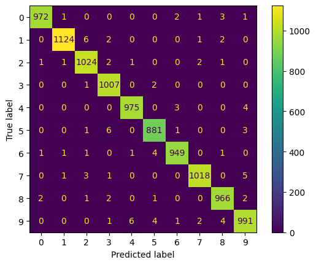

# Digit Recognition using CNN

This repository contains a Convolutional Neural Network (CNN) model to recognize handwritten digits. The model achieves high accuracy and strong performance metrics on the test set.

---

## Dataset
- **Name**: MNIST
- **Size**: 70,000 images (60,000 for training, 10,000 for testing) 
- **Image Shape**: 28×28 pixels, grayscale
- **Classes**: 10 (digits from 0 to 9

---

## Model Architecture
Below is the summary of the CNN layers:

1. **Conv2D**: 6 filters, kernel size (5×5), activation ReLU  
2. **MaxPooling2D**: pool size (2×2)  
3. **Conv2D**: 16 filters, kernel size (5×5), activation ReLU  
4. **MaxPooling2D**: pool size (2×2)  
5. **Conv2D**: 120 filters, kernel size (5×5), activation ReLU  
6. **Flatten**  
7. **Dense**: 84 units, activation ReLU  
8. **Dropout**: rate ( 0.5)  
9. **Dense**: 10 units, activation Softmax (for multi-class classification)

---

## Performace Measure

1.**Precision**:0.9907131398947655

2.**Recall**:0.9907

3.**F1 Score**:0.9907005846712633

4.**ROC AUC**: 0.999917446

5.**Confusion Matrix**: 

